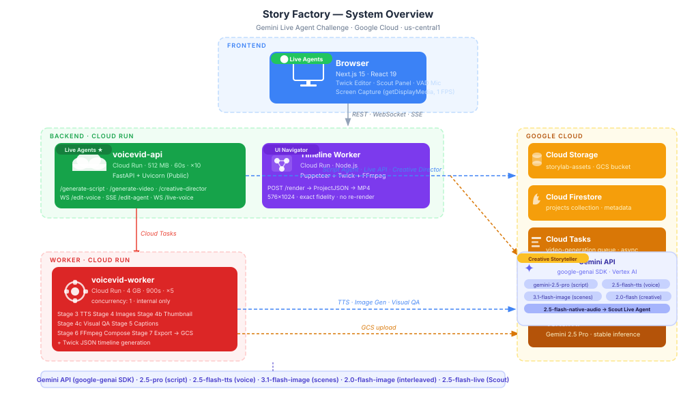
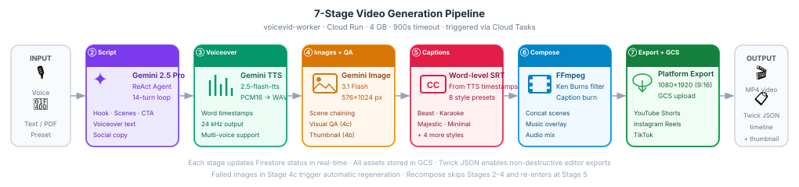

# Story Factory — Gemini Live Agent Challenge Submission

**Turn any idea into a publish-ready short-form video — guided by a live AI that sees, hears, and edits alongside you.**

Story Factory is a multimodal AI video creation and editing platform powered by Gemini Live API. Users can describe an idea by voice and Scout (the live AI agent) creates a full video from scratch — proposing scripts, generating storyboards, and building an editable timeline — or they can generate a video through the 7-stage automated pipeline and have Scout refine it in real-time. Scout sees the screen, applies 25+ targeted edits, and responds naturally to interruptions.

---

## Hackathon Tracks Addressed

| Track | How Story Factory covers it |
|-------|-----------------------------|
| **Live Agents (Primary)** | Scout — a Gemini Live voice agent that creates videos from scratch and edits them through natural conversation, handles interruptions, and maintains session state across tool calls |
| **Creative Storyteller** | Creative Director uses `gemini-2.0-flash-preview-image-generation` to stream interleaved text + image in one API call — 5 modes: storybook, marketing, educational, social content, manga panels |
| **UI Navigator** | Screen Sharing Agent — Scout captures the user's screen at 1 FPS, streams frames into the Live session, and references the visual editor state when making or explaining edits |

**Mandatory tech:** Gemini Live API · Google GenAI SDK · Google Cloud (Cloud Run, Cloud Tasks, Firestore, GCS, Vertex AI)

---

## What We Built

A real-time AI-assisted short-form video creator and editor with three layers:

1. **Create** — describe your idea by voice to Scout (scratch workflow: propose scripts → storyboard → build timeline), or use the wizard with a 7-stage automated pipeline (TTS, images, animation, captions, music, export)
2. **Edit** — talk to Scout in the editor; Scout sees your screen and applies 25+ targeted edits without re-rendering from scratch
3. **Publish** — direct upload to YouTube Shorts, Instagram Reels, or TikTok

---

## Features & Functionality

### 1. Scout — Live Voice Agent *(Live Agents track)*

Scout is a Gemini Live-powered conversational agent with two modes:

- **Creation mode** (`WS /api/v1/voice-agent`) — start from nothing; Scout proposes scripts, generates storyboards, and builds a complete Twick timeline from voice input alone
- **Edit mode** (`WS /api/v1/projects/{id}/edit-voice`) — Scout edits an existing project in the editor; requires a completed/draft project

Shared capabilities across both modes:
- Listens continuously via WebSocket (16 kHz PCM16 audio), responding with low-latency voice output (24 kHz)
- Supports **natural interruptions** — browser-side Voice Activity Detection (VAD) lets the user cut Scout off mid-sentence and redirect
- Has **25+ edit tools** across music, captions, text overlays, images, effects, timing, and AI generation:
  - `set_background_music`, `generate_lyria_music` — music changes + AI-generated tracks
  - `update_caption_style`, `add_hook_title`, `add_text_overlay` — text and caption edits
  - `apply_effect` — 14 visual effects: `glitch`, `sepia`, `vignette`, `pixelate`, `warp`, `rgbShift`, `halftone`, `hueShift`, `waveDistort`, `tvScanlines`, `hdr`, `retro70s`, `bubbleSparkles`, `heartSparkles`
  - `edit_selected_image`, `generate_image_for_scene`, `replace_selected_media` — AI image editing on individual scenes
  - `generate_thumbnail_options` — AI-generated thumbnail variants
  - `trim_element`, `move_element`, `delete_element`, `adjust_volume`, `resize_element` — timeline edits
  - `propose_scripts`, `generate_storyboard`, `build_timeline_from_storyboard` — creation workflow
- Maintains **stateful session context** — Scout tracks the current project, selected elements, and timeline position across turns
- Streams tool results back as both voice and structured JSON events, so the UI updates live while Scout narrates the change

**Key files:** [`backend/routers/voice/agent.py`](backend/routers/voice/agent.py) · [`backend/routers/voice/edit.py`](backend/routers/voice/edit.py) · [`backend/services/gemini/editing/voice_runtime.py`](backend/services/gemini/editing/voice_runtime.py)

---

### 2. Create From Scratch — Voice-First Story Director *(Live Agents track)*

Scout acts as a creative director for users who want to create a video from nothing:

- User describes their idea by voice (topic, tone, audience, style)
- Scout runs a 3-step workflow entirely through the Live API:
  1. **`propose_scripts`** — presents 3 script options with different hooks and structures, reads them aloud for the user to pick from
  2. **`generate_storyboard`** — generates AI images for each scene using the approved script, streams the storyboard back as a visual preview
  3. **`build_timeline_from_storyboard`** — assembles the approved storyboard into a fully editable Twick JSON timeline with voiceover, captions, and music
- All three steps happen in one continuous voice conversation — no clicking through a wizard

**Route:** `WS /api/v1/voice-agent`
**Key files:** [`backend/routers/voice/agent.py`](backend/routers/voice/agent.py) · [`backend/services/gemini/editing/constants.py`](backend/services/gemini/editing/constants.py)

---

### 3. Screen Sharing Agent *(UI Navigator track)*

When the user clicks "Share Screen", Scout gains visual awareness:

- Browser captures the screen via `getDisplayMedia()`, encodes each frame as JPEG (80% quality), and sends it as base64 JSON over the same WebSocket at 1 FPS
- Scout receives frames inline in the Gemini Live context window — it can reference what it sees ("I can see your title card is overlapping the subject's face")
- Screenshot also auto-triggers on "inspect" keywords (`analyze`, `what's wrong`, `feedback`, etc.)
- No DOM access required — Scout interprets the editor's visual state purely from pixel data

**Key files:** [`frontend-sky/hooks/use-voice-edit-session.ts`](frontend-sky/hooks/use-voice-edit-session.ts) · [`backend/services/gemini/editing/voice_runtime.py`](backend/services/gemini/editing/voice_runtime.py)

---

### 4. Script Generation (AI Director)

A **Gemini 2.5 Pro ReAct agent** runs a multi-turn reasoning loop (up to 14 turns) to produce a structured script from any input:

| Input mode | What happens |
|------------|--------------|
| **Speech** | Mic audio → Gemini transcribes + detects tone → feeds script agent |
| **Text** | Free-form text or PDF (OCR via Gemini) → script agent |
| **Preset** | Niche topic → Reddit trending hooks injected → script agent |

Internal tools: `search_trending_hooks`, `analyze_brand_voice`, `optimize_for_platform`, `validate_script_quality`. Output: scenes, voiceover text, CTA, and social copy for TikTok / Instagram / YouTube.

**Route:** `POST /api/v1/projects/{id}/generate-script`

---

### 5. 7-Stage Video Pipeline

Once a script is approved, a background worker (Cloud Tasks) runs:

```
Stage 1.5  Reference subject inference  (optional — from uploaded photo)
Stage 2    Script generation            Gemini 2.5 Pro ReAct agent
Stage 3    Voiceover (TTS)             Gemini 2.5 Flash TTS → WAV + word timestamps
Stage 4    Scene images                Gemini Image 3.1 Flash — 576×1024 per scene
Stage 4c   Visual QA                   Reject low-quality images, regenerate
Stage 4b   Thumbnail                   Separate thumbnail image
Stage 5    Captions                    Word-level SRT from TTS timestamps
Stage 6    Composition                 FFmpeg: concat + Ken Burns + caption burn + music
Stage 7    Export                      Platform resize + GCS upload
         + Timeline                    Twick-compatible JSON timeline
```

| Stage | Technology |
|-------|-----------|
| **Voiceover** | Gemini 2.5 Flash Preview TTS — raw PCM16 → WAV |
| **Scene Images** | Gemini Image 3.1 Flash — character consistency via image-to-image chaining |
| **Animation** | FFmpeg `zoompan` Ken Burns filter (dolly, crane, zoom variants) |
| **Captions** | Word-level SRT, 8 style presets (Beast, Karaoke, Majestic, etc.) |
| **Composition** | FFmpeg: concat → mix audio → burn captions → mix music |
| **Export** | YouTube Shorts, Instagram Reels, TikTok (1080×1920, platform bitrates) |

**Routes:** `POST /api/v1/projects/{id}/generate-video` · `GET /api/v1/projects/{id}/status`

---

### 6. Creative Director — Interleaved Multimodal *(Creative Storyteller track)*

Uses `gemini-2.0-flash-preview-image-generation` with `response_modalities=["TEXT", "IMAGE"]` to stream a single interleaved output — alternating text narration and generated images in one coherent flow. Five distinct modes:

| Mode | Output |
|------|--------|
| `storybook` | Illustrated story chapters — narration interleaved with scene images |
| `marketing` | Brand copy + visuals + social package in one stream |
| `educational` | Narration woven with inline diagrams and explanatory imagery |
| `social_content` | Caption + generated image + hashtags as a single cohesive output |
| `manga` | Manga-style comic panels with dialogue and action sequences |

**Routes:** `POST /api/v1/creative-director/generate` · `POST /api/v1/creative-director/generate-stream`
**Key file:** [`backend/services/gemini/interleaved.py`](backend/services/gemini/interleaved.py)

---

### 7. Timeline Render Worker

A standalone Node.js service (Cloud Run) that renders a Twick JSON timeline into an MP4 using Puppeteer (headless Chromium) + `@twick/renderer` + FFmpeg:

```
POST /render  →  Twick ProjectJSON  →  Puppeteer + Twick visualizer  →  FFmpeg  →  MP4
```

This allows non-destructive editor exports: the user tweaks the Twick timeline in-browser, hits Export, and the worker renders the exact frame-for-frame timeline without touching the original TTS audio or scene images.

**Key files:** [`timeline-render-worker/server.mjs`](timeline-render-worker/server.mjs) · [`timeline-render-worker/render-timeline.mjs`](timeline-render-worker/render-timeline.mjs)

---

### 8. Recompose — Non-destructive Edit

Change caption style or background music on a completed video without re-running TTS or image generation. Downloads the preserved `with_audio.mp4` from GCS, re-burns captions, re-mixes music, re-uploads.

**Route:** `POST /api/v1/projects/{id}/recompose`

---

### 9. Publish

Direct YouTube upload via OAuth2. Instagram / TikTok manual download with formatted captions and hashtags.

**Route:** `POST /api/v1/projects/{id}/publish`

---

## API Endpoints

```
# Projects
POST   /api/v1/projects/create-empty              Create empty project (for voice-agent scratch flow)
GET    /api/v1/projects/                           List all user projects
GET    /api/v1/projects/{id}/status               Poll pipeline status + stage progress

# Generation
POST   /api/v1/projects/{id}/generate-script      Script agent (voice / text / preset)
POST   /api/v1/projects/{id}/generate-video       7-stage pipeline (async 202 or sync 200)
POST   /api/v1/projects/{id}/recompose            Re-burn captions/music without re-generating TTS/images

# Voice Agent
WS     /api/v1/voice-agent                        Scout creation from scratch (no existing project needed)
WS     /api/v1/projects/{id}/edit-voice           Scout editing existing project (requires completed/draft status)
WS     /api/v1/projects/{id}/live-voice           Real-time Gemini Live transcription

# Creative Director
POST   /api/v1/creative-director/generate         Interleaved text+image (buffered)
POST   /api/v1/creative-director/generate-stream  Interleaved text+image (SSE stream)

# Media
POST   /api/v1/transcribe                         Audio → text (Gemini)
POST   /api/v1/ocr-pdf                            PDF → text (Gemini)

# Publishing
POST   /api/v1/auth/youtube                       YouTube OAuth initiation
POST   /api/v1/publish/{id}                       Publish to YouTube / Instagram / TikTok

GET    /health                                    Health check
GET    /docs                                      Swagger UI
```

---

## Architecture

### System Overview


### Video Generation Pipeline


---

## Technologies Used

### Backend
| Technology | Role |
|-----------|------|
| **Python 3.12 + FastAPI** | API server, WebSocket + SSE endpoints |
| **Google GenAI SDK (`google-genai`)** | All Gemini calls — script, images, TTS, OCR, transcription, Live API |
| **Vertex AI** | Production inference for stable Gemini models |
| **FFmpeg** | Ken Burns animation, caption burn, audio mix, platform export |
| **Cloud Run** | Serverless container hosting (API + Worker services) |
| **Cloud Tasks** | Async job queue for long-running video pipeline |
| **Cloud Firestore** | Project metadata storage |
| **Cloud Storage** | Video, audio, image, and asset storage |
| **Secret Manager** | API key and OAuth credential management |
| **Cloud Build + Artifact Registry** | Docker CI/CD pipeline |
| **Firebase Admin SDK** | User authentication verification |
| **SendGrid** | Email notifications on video completion |
| **Pillow** | Image manipulation |

### Timeline Render Worker
| Technology | Role |
|-----------|------|
| **Node.js** | Service runtime |
| **Puppeteer** | Headless Chromium for Twick renderer |
| **@twick/core + @twick/renderer** | Timeline-to-video rendering |
| **@twick/ffmpeg** | FFmpeg integration in Node context |

### Frontend
| Technology | Role |
|-----------|------|
| **Next.js 15 (App Router)** | React 19 framework |
| **Tailwind CSS v4** | Styling |
| **Framer Motion** | Animations |
| **Radix UI** | Accessible component primitives |
| **Web Audio API** | Raw PCM16 mic capture + VAD for live sessions |
| **MediaDevices API** | Screen capture (`getDisplayMedia`) |
| **Firebase Auth** | User authentication |

### External Data Sources
- **Reddit API** — trending hooks and post content for preset-based scripts
- **YouTube Data API v3** — OAuth upload and channel management
- **Lyria (Google)** — AI music generation for background tracks

---

## Spin-Up Instructions

### Option 1: Docker (Recommended)

The fastest way to run the full stack. Requires **Docker Desktop** and a **Gemini API key**.

**Step 1 — Configure the backend:**
```bash
cp backend/.env.example backend/.env
# Open backend/.env and set:
#   GEMINI_API_KEY=<your key from https://aistudio.google.com/apikey>
#   GOOGLE_CLOUD_PROJECT=<your GCP project ID>
#   GCS_BUCKET=<your GCS bucket name>
```

**Step 2 — GCP credentials** (for Cloud Storage + Firestore access):

*Option A — gcloud CLI (recommended):*
```bash
gcloud auth application-default login
# Then uncomment this line in docker-compose.yml under voicevid-api volumes:
#   - ${HOME}/.config/gcloud:/root/.config/gcloud:ro
```

*Option B — service account key:*
```bash
# Place your downloaded key at ./credentials.json, then uncomment in docker-compose.yml:
#   - ./credentials.json:/app/credentials.json:ro
# And add to backend/.env:
#   GOOGLE_APPLICATION_CREDENTIALS=/app/credentials.json
```

**Step 3 — Build and run:**
```bash
docker compose up --build
```

| Service | URL |
|---------|-----|
| Frontend | http://localhost:3000 |
| API | http://localhost:8000 |
| API docs | http://localhost:8000/docs |
| Health | http://localhost:8000/health |

The `timeline-render-worker` (headless Chromium renderer) starts automatically and is only accessible internally — no host port needed.

> **Note:** The first build takes ~5–10 minutes (installs Python deps, pnpm deps, builds Next.js, pulls Chromium). Subsequent starts use Docker's layer cache.

---

### Option 2: Manual Local Setup

**Prerequisites:** Python 3.12+, Node.js 20+, `pnpm`, `ffmpeg`

**Backend:**
```bash
cd backend
pip install -r requirements.txt
cp .env.example .env
# Fill in GEMINI_API_KEY, GOOGLE_CLOUD_PROJECT, GCS_BUCKET in .env

uvicorn main:app --reload --port 8000
# API docs: http://localhost:8000/docs
```

**Frontend:**
```bash
cd frontend-sky
pnpm install
cp .env.example .env.local
# Edit .env.local — defaults already point to localhost:8000

pnpm dev
# App: http://localhost:3000
```

**Timeline Render Worker (optional — for editor exports):**
```bash
cd timeline-render-worker
npm install
node server.mjs
# Health: http://localhost:8080/health
# Set TIMELINE_RENDER_WORKER_URL=http://localhost:8080 in backend/.env to enable
```

---

### Required Environment Variables

| Variable | Required | Description |
|----------|----------|-------------|
| `GEMINI_API_KEY` | **Yes** | Gemini API key from [AI Studio](https://aistudio.google.com/apikey) |
| `GOOGLE_CLOUD_PROJECT` | **Yes** | GCP project ID |
| `GCS_BUCKET` | **Yes** | Cloud Storage bucket name |
| `USE_VERTEX_AI` | No | `true` for Vertex AI, `false` for API key (default: `false`) |
| `WORKER_URL` | No | Worker Cloud Run URL — leave blank for synchronous local pipeline |
| `TIMELINE_RENDER_WORKER_URL` | No | Renderer URL — set automatically by Docker Compose |
| `SENDGRID_API_KEY` | No | Email notifications on video completion |

Full variable reference: [`backend/.env.example`](backend/.env.example)

---

## Google Cloud Deployment

The backend runs as two Cloud Run services in `us-central1`:

| Service | URL | Purpose |
|---------|-----|---------|
| `voicevid-api` | https://voicevid-api-arkk5ohwka-uc.a.run.app | Public API + WebSocket endpoints |
| `voicevid-worker` | Internal (Cloud Tasks only) | Video pipeline worker |

**Health check:** https://voicevid-api-arkk5ohwka-uc.a.run.app/health
**API docs:** https://voicevid-api-arkk5ohwka-uc.a.run.app/docs

**Deployment is fully scripted:**
```bash
./deploy.sh   # Cloud Build → Artifact Registry → Cloud Run (both services)
```

**Verify deployment:**
```bash
gcloud run services logs read voicevid-api --region=us-central1 --project=voicevid
gcloud run services logs read voicevid-worker --region=us-central1 --project=voicevid
```

**GCP services in use:**
- Cloud Run (voicevid-api + voicevid-worker)
- Cloud Build (Docker image → Artifact Registry → Cloud Run)
- Cloud Tasks (`video-generation` queue, us-central1, max 2 retries)
- Cloud Firestore (`projects` collection)
- Cloud Storage (`storylab-assets` bucket)
- Secret Manager (`gemini-api-key`, `sendgrid-api-key`, `youtube-client-secrets`)
- Vertex AI (Gemini 2.5 Pro stable inference)

**Key source references:**
- GCS integration: [`backend/services/storage/gcs.py`](backend/services/storage/gcs.py)
- Gemini client: [`backend/services/gemini/client.py`](backend/services/gemini/client.py)
- Cloud Tasks dispatch: [`backend/services/infra/task_queue.py`](backend/services/infra/task_queue.py)
- Deployment config: [`deploy.sh`](deploy.sh) · [`cloudbuild.yaml`](backend/cloudbuild.yaml)

---

## Findings & Learnings

### Gemini Model Routing (API Key vs Vertex AI)
The `google-genai` SDK silently switches to Vertex AI when `GOOGLE_CLOUD_PROJECT` is set — even when an explicit `api_key` is provided. Fix: always pass `vertexai=False` explicitly for API-key-based clients. This was critical for preview models (image generation, TTS preview) that are only available via API key, not Vertex AI.

### Two-Service Architecture for Video
Video generation (TTS + 8 images + FFmpeg) takes 3–8 minutes per project. Separating a lightweight public API (512 MB, 60s timeout) from a beefy worker (4 GB, 900s timeout) keeps the API responsive while Cloud Tasks queues the heavy lifting. Worker ingress is **internal only** — it is never publicly reachable.

### Character Consistency Without Fine-Tuning
Passing the previous scene's image alongside a character reference image (scene 1) as context for each new image generation significantly improves visual consistency across scenes — purely via image context, no LoRA or fine-tuning required.

### Interleaved Multimodal in a Single API Call
`gemini-2.0-flash-preview-image-generation` with `response_modalities=["TEXT", "IMAGE"]` returns a single stream of alternating text and image parts. This lets the Creative Director produce a fully coherent illustrated package (narration + images) in one API call rather than coordinating separate text and image requests.

### Secret Manager for OAuth Files
YouTube OAuth requires a `client_secrets.json` file path, not just an env var string. Mounting it as a Secret Manager volume (`--set-secrets=/secrets/file.json=secret-name:latest`) on Cloud Run makes it available as a real file at a known path without baking credentials into the Docker image.

### Screen Frame Streaming over WebSocket
Streaming screen frames at 1 FPS into a Gemini Live session requires careful framing: each frame is sent as a base64-encoded JSON message alongside the ongoing audio stream. The Live API accepts both modalities concurrently, allowing Scout to reference the visual editor state mid-conversation without pausing the audio turn.

### Voice Activity Detection for Natural Interruptions
Browser-side VAD (RMS threshold on captured PCM16 audio) lets the user cut Scout off mid-response without a push-to-talk button. When silence is detected after speech, the frontend marks the turn as complete and sends the audio chunk — keeping the conversation feel natural and interruptible without server-side VAD complexity.

### Twick + Puppeteer for Timeline Export
Rendering a Twick JSON timeline to MP4 server-side requires a real browser (Twick uses React + WebGL). Puppeteer in headless mode spins up a Chromium instance running the Twick visualizer, captures frames, and pipes them to FFmpeg — giving exact visual fidelity between what the user sees in the editor and the final export.
